<h1 align="center">AkNotes</h1>
<p align="center">
  <b>Gestor de Notas moderno hecho con C# + Windows Forms + MongoDBAtlas</b><br>
  <i>Desarrollado por Kenneth Waldo (23300757)</i>
</p>

---

### ✨ Vista previa
<p align="center">
  
</p>

---

### 🧠 Descripción

**AkNotes** es una una aplicación desarrollada usando **C# y Windows Forms en .NET 9**, el cual se conecta a una base de datos
alojada en **MongoDB** en un servidor **remoto** controlado y gestionado mediante roles, permisos y usuarios.

---

### 🚀 Características

- ✅ Permite crear, editar, borrar, y ver notas creadas
- 🏷️ Permite añadir múltiples etiquetas predefinidas (tags)  
- 🔐 Sistema de inicio de sesión y registro con seguridad en caso de SQL Injection
- 💾 Guardado automático en **MongoDB**  
- 🎨 Interfaz moderna y responsiva  

---

# ⚙️ Instalación

### 1️⃣ Clonar el repositorio desde un IDE
```bash
git clone https://github.com/tuusuario/AkNotes.git
```
### Recomendamos usar Visual Studio 2022
1. Abre Visual Studio 2022.
2. Selecciona en "Clonar un repositorio".
3. Selecciona la ruta de acceso donde se guardará el proyecto.
4. Seleccionar "Examinar un repositorio>GitHub".
5. Selecciona el repositorio actual de AkNotes.
6. Presiona en clonar
7. Ejecuta el proyecto una vez dentro de la solución del proyecto (Flecha verde)
8. Prueba libremente cualquier sección del proyecto en ejecución.

---

# Capturas de pantalla de la aplicación funcionando

<p align="center">
  
<br>
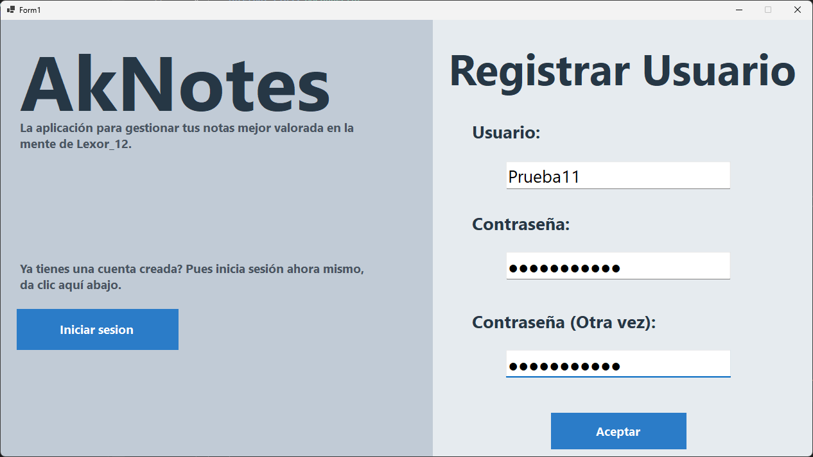
<br>
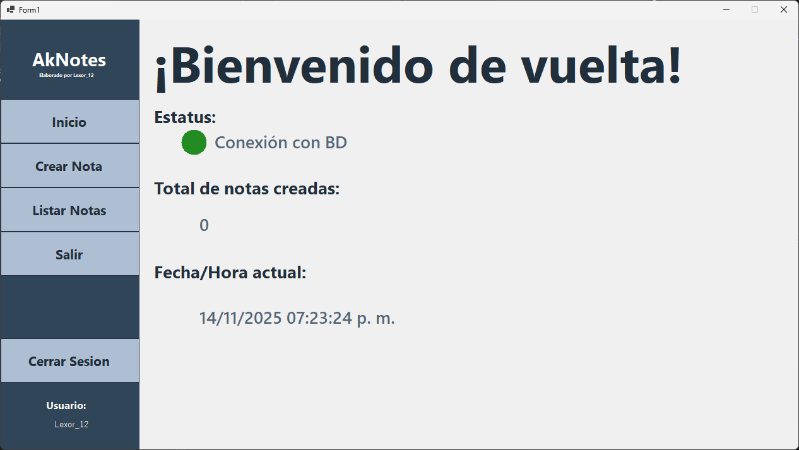
<br>
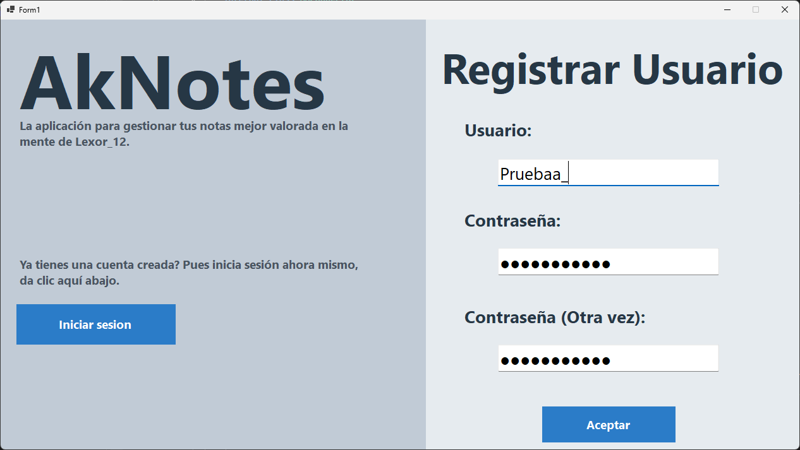
<br>
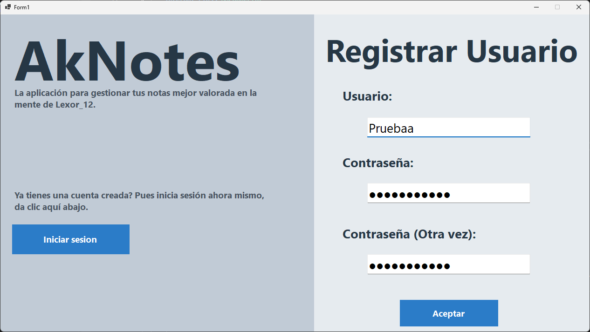
<br>
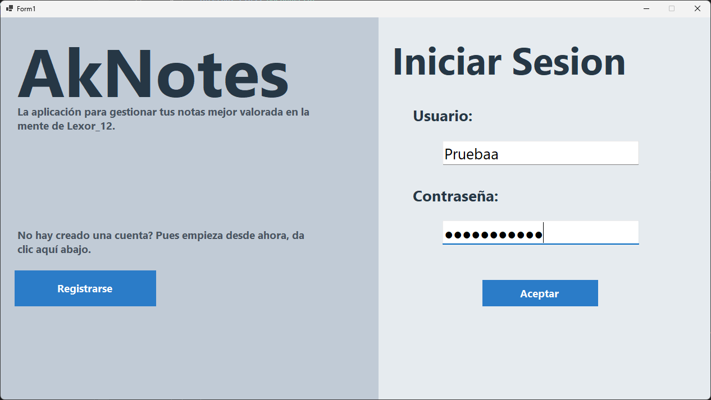
<br>

<br>
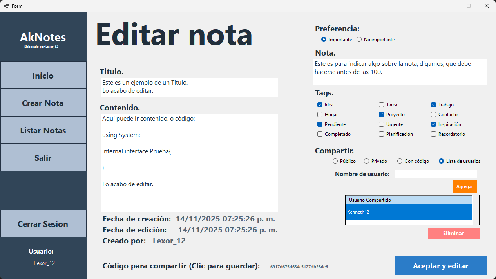
<br>
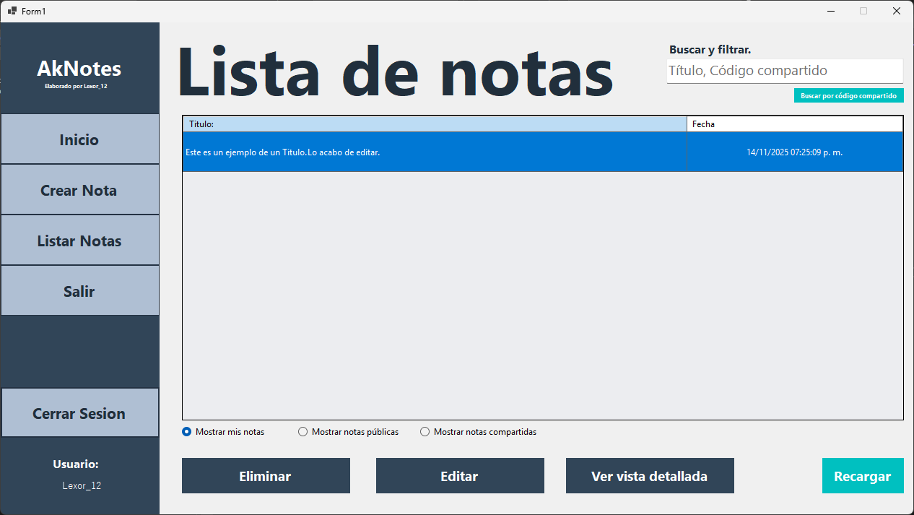
<br>
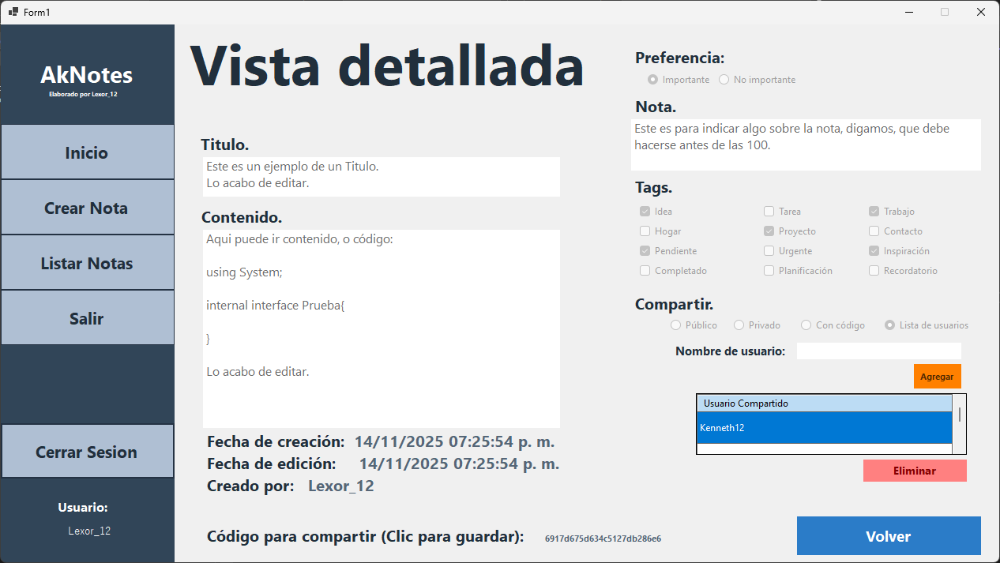
<br>
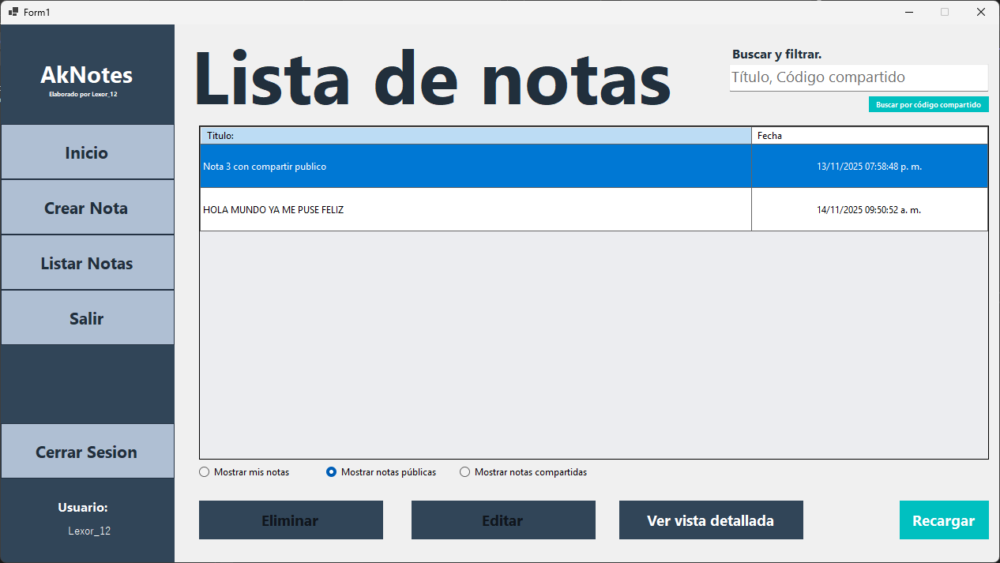
<br>

<br>
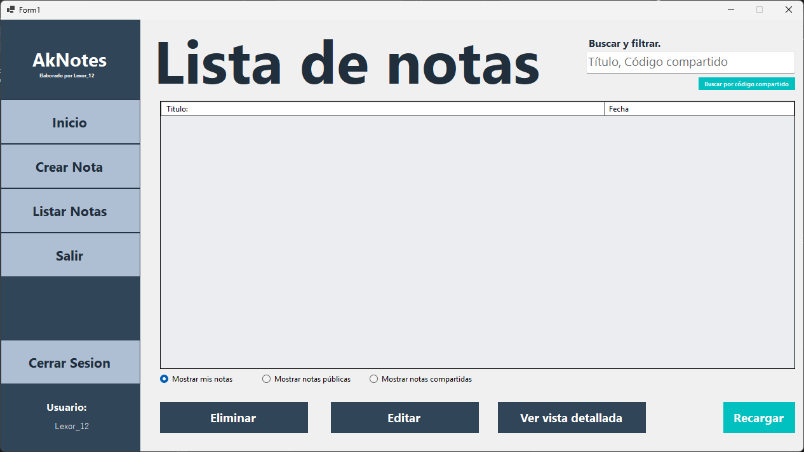
<br>
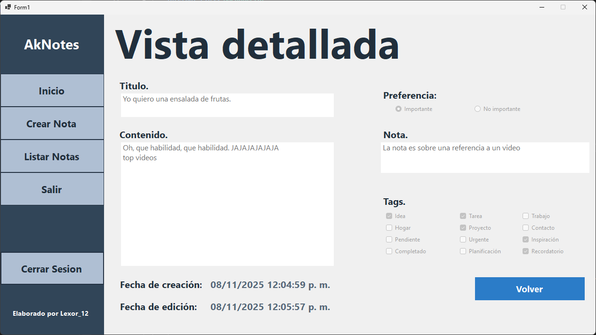
<br>
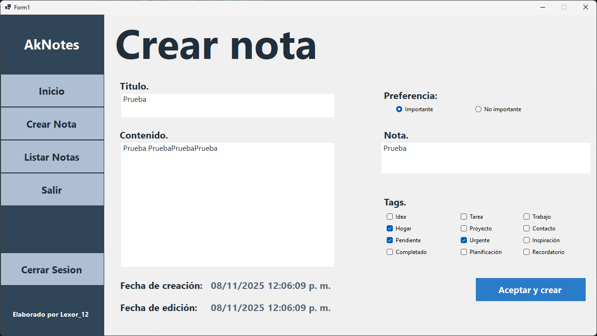
<br>
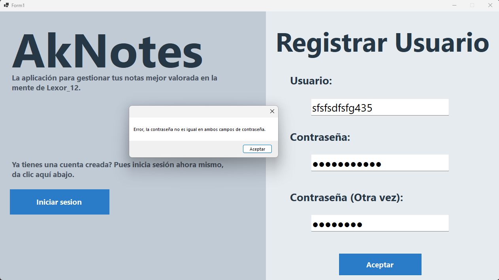
<br>

<br>

<br>

<br>
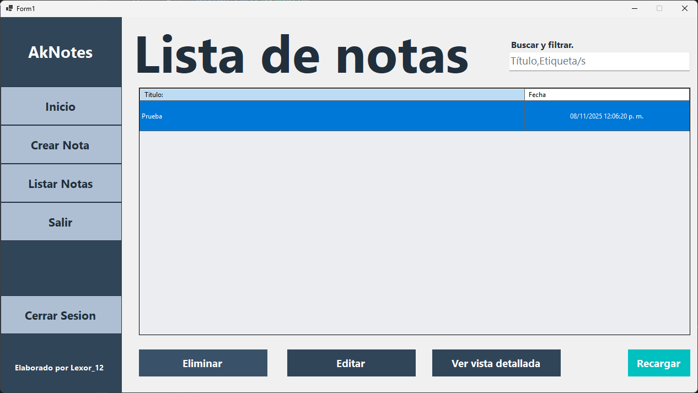
<br>
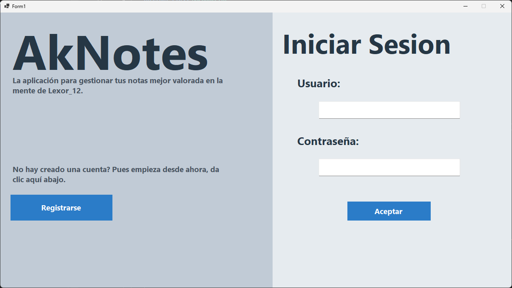

</p>

---

# Ejemplo de configuración de la cadena de conexión a 

```C#
internal class BDConnector
{
    private static BDConnector? _BDConnector = null;
    private MongoClient? _mongoClient;
    protected IMongoDatabase db;

    protected BDConnector() 
    {
        string? MongoDBConn = Program.Configuration?["MongoDB:ConnectionString"];
        string? dbName = Program.Configuration?["MongoDB:DatabaseName"];
        _mongoClient = new MongoClient(MongoDBConn);
        db = _mongoClient.GetDatabase(dbName);
    }
    public static BDConnector GetInstancia()
    {
        if ( _BDConnector == null)
        {
            _BDConnector = new BDConnector();
        }
        return _BDConnector;
    }
    public IMongoCollection<T> GetCollection<T>(string nombreCollection) 
    {
        return db.GetCollection<T>(nombreCollection);   
    }
}
```
---
